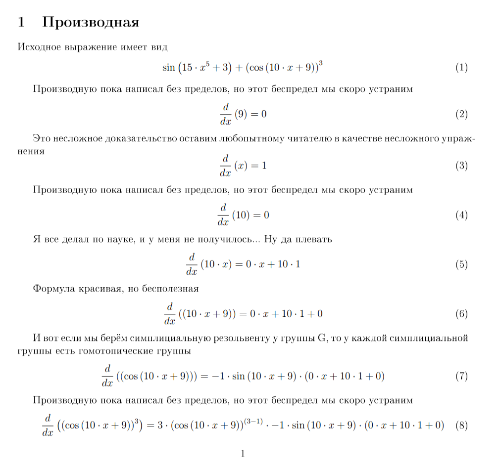
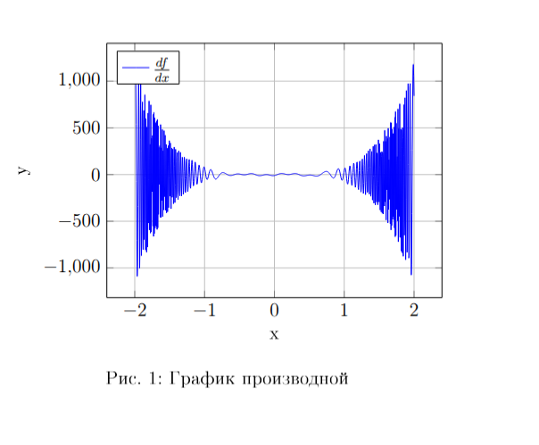
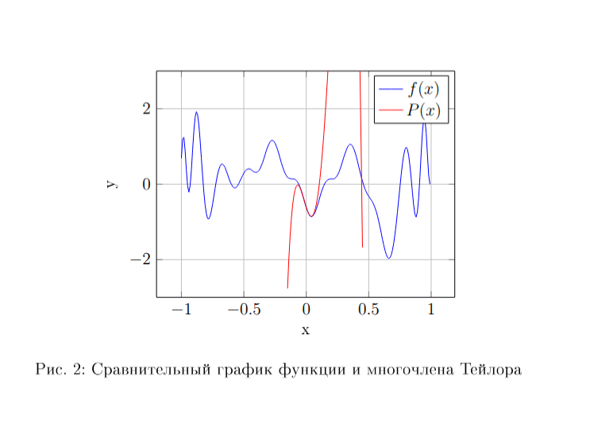

# Tree-based derivative calculator

- [General description](#general-description)
- [Input](#input)
- [Usage](#usage)
    - [Prerequsites](#prerequisites)
    - [Build & run](#build--run)

## General description
This program accepts a .txt file with a function as input and 
outputs latex file. 

Capatabilities:
- calculating function derivate (verbose, step-by-step)
- expanding into Taylor series
- plotting

### Example





Examples are to be found in `./example/` folder.

## Input

Example:
```
sin(15*x^5+3)+(exp(10*x+9))^3
```

Following operators and functions are supported:
| | |
| ------- | -------- |
Basic math operators | `+, -, *, /, ^` | 
| Exponent | `exp()`
| Square root | `sqrt()` |
| Natural logarithm | `ln()` |
| Trigonometric funcs | `sin(), cos(), tan(), ctg()` |
| Hyperbolic funcs | `sh(), ch(), th()` |
| Invers trigonometric funcs | `arcsin(), arccos(), arctg()` |


## Usage

### Prerequisites

| Packet | Version |
| --------- | ---------|
| `make`  | >= 4 |
| `gcc`  | >= 13 |
| `latexmk` (optional) | |

### Build & run

Clone this repository to your machine, go to repository root and run `make`.

#### CLI Options
| | |
|-------|--------|
| `--log` | logfile |
| `--in`  | input file path | 
| `--out` | output file name | 
| `--power` | Taylor series order | 
| `--x0` | Taylor series point | 
| `--ymin` | plot Y-axis min value | 
| `--ymax` | plot Y-axis max value |
